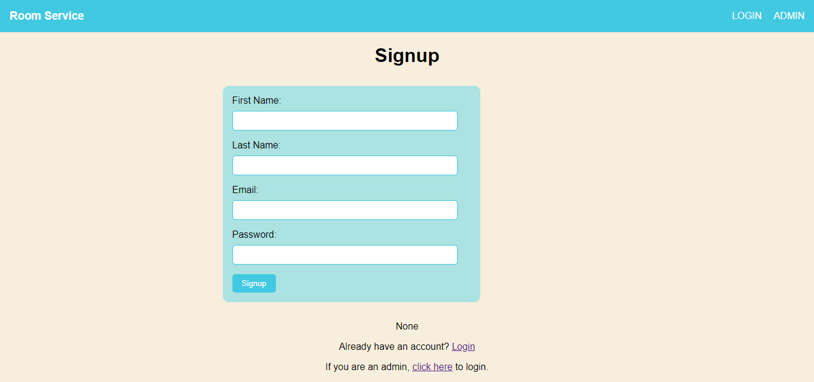
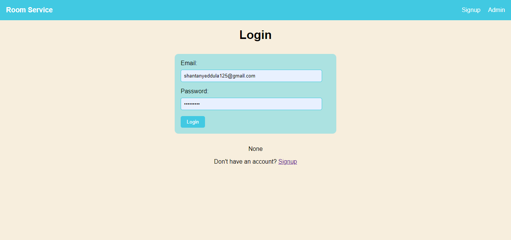
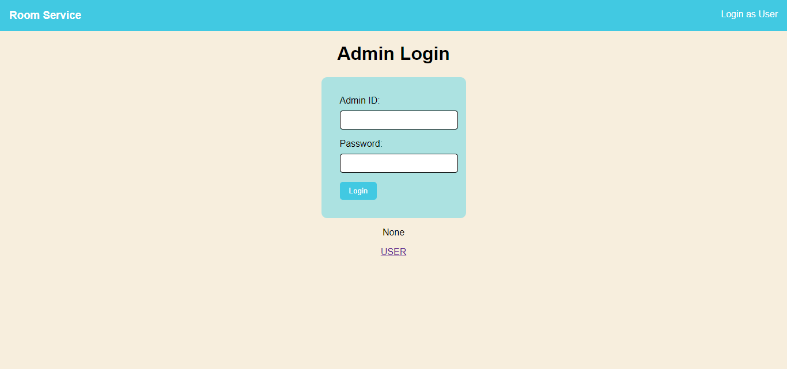
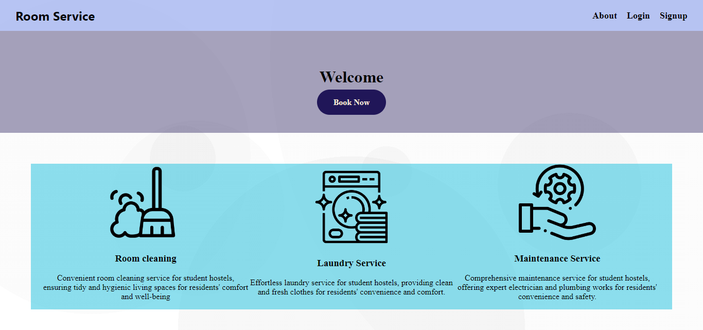
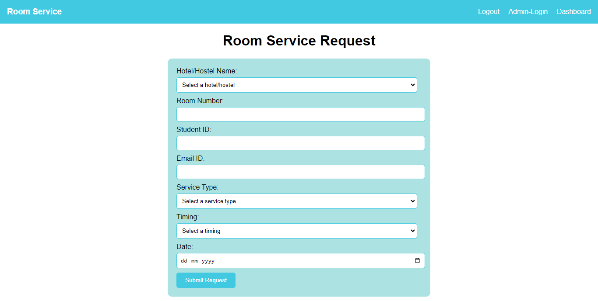
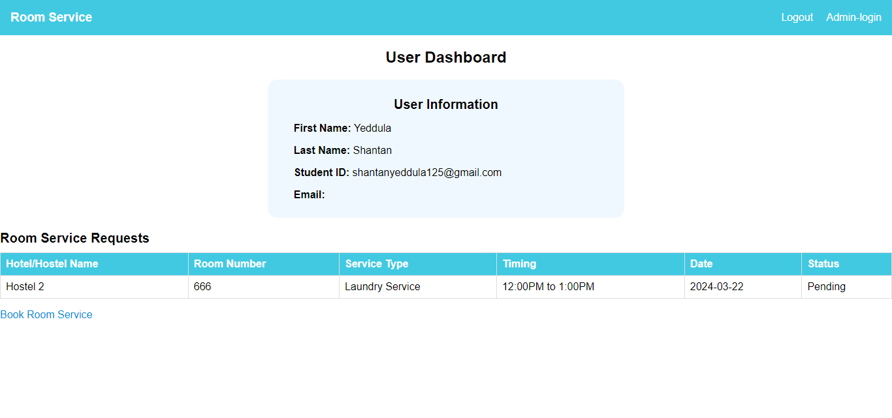
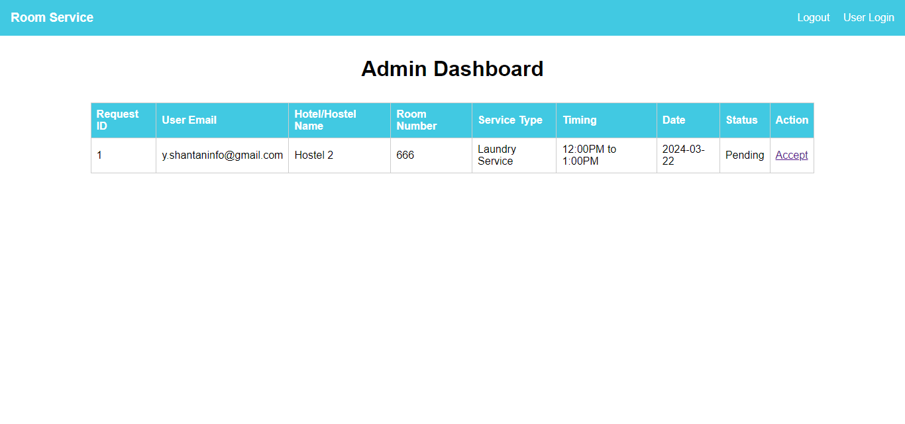
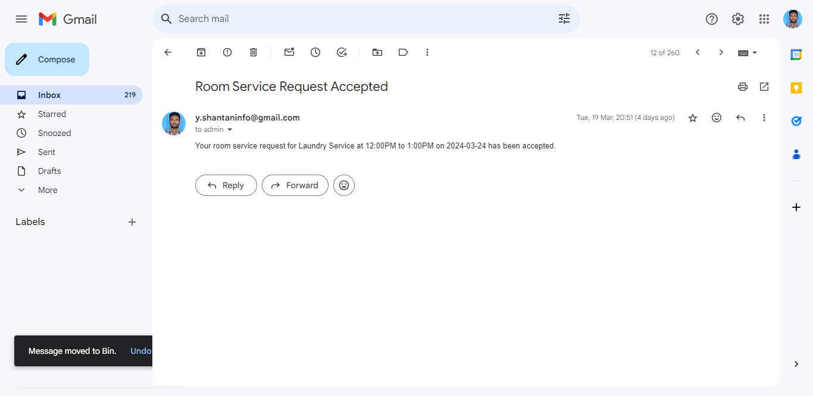

# Room Service Management System

This Room Service Management System is a web application built using Flask, a lightweight Python web framework. The application allows users to request room services in hotels and enables administrators to manage these requests efficiently. It includes features such as user authentication, secure password hashing, email notifications, and session management.

## Features

1. **User Management**:
   - Users can sign up with their first name, last name, email, and password.
   - Passwords are securely hashed using bcrypt before being stored in the database.
   - Users can log in with their email and password.

2. **User Dashboard**:
   - Authenticated users can view their profile information and any room service requests they have submitted.

3. **Room Service Requests**:
   - Authenticated users can submit room service requests, providing details such as hotel name, room number, service type, timing, and date.
   - These requests are stored in the database and can be viewed in the user dashboard.

4. **Admin Management**:
   - Admins can log in with their admin ID and password.
   - Admins have access to an admin dashboard where they can view all room service requests.
   - Admins can accept room service requests, which triggers an email notification to the user.

5. **Email Notifications**:
   - Email notifications are sent to users when their room service requests are accepted.

6. **Session Management**:
   - Sessions are used to maintain user and admin authentication.

7. **Logout**:
   - Users and admins can log out, clearing their session.

8. **Security Measures**:
   - The application uses bcrypt for password hashing to securely store passwords.
   - It includes measures to prevent caching of sensitive information.

## Screenshots

1. **Signup Page**  
   

2. **Login Page**  
   

3. **Admin Login Page**  
   

4. **Home Page (welcome.html)**  
   

5. **Room Service Request Page**  
   

6. **User Dashboard**  
   

7. **Admin Dashboard**  
   

8. **Email Message**  
   

## Instructions

To use the Room Service Management System, follow these steps:

1. **Setup Environment**:
   - Ensure you have Python installed on your system.
   - Install Flask using `pip install Flask`.

2. **Configure Email Settings**:
   - Open the `app.py` file and update the `sender_email` and `sender_password` variables with your Gmail address and password. This is required for sending email notifications.

3. **Run the Application**:
   - Navigate to the project directory in the terminal.
   - Run the Flask application by executing `python app.py`.
   - Access the application in a web browser at `http://localhost:5000`.
